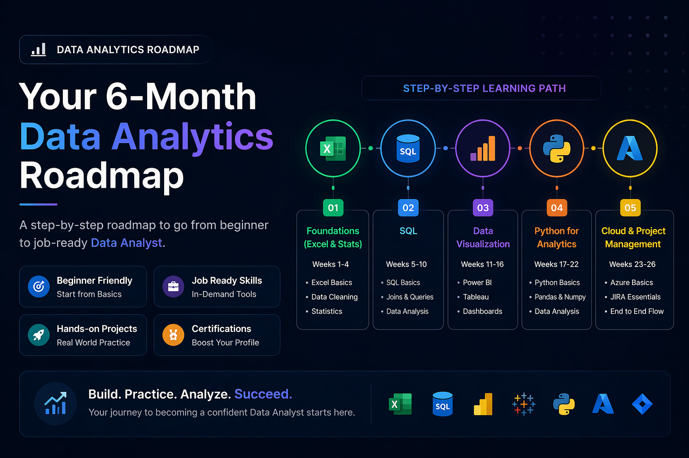

# 🚀 Data Analytics Learning Roadmap

An interactive, beginner-to-job-ready roadmap designed to guide aspiring data analysts step-by-step through the most important tools, skills, and projects.

🔗 **Live Demo:**
https://data-analytics-roadmap-ysfh.vercel.app/

---

## 📌 About the Project

This project is a **structured 6-month roadmap** that helps beginners transition into a job-ready Data Analyst.

It covers:

* Excel & Data Fundamentals
* SQL (Core Analyst Skill)
* Data Visualization (Power BI & Tableau)
* Python for Analytics
* Cloud (Azure) & Project Management (JIRA)

---

## ✨ Features

* Interactive UI with expandable learning phases
* Tool-wise breakdown (topics, resources, projects)
* Real-world project suggestions
* Certification guidance
* Job search tips for beginners

---

## 🛠️ Tech Stack

* React (Vite)
* JavaScript (ES6)
* Inline CSS styling

---

## 📚 Roadmap Overview

| Phase   | Focus Area                 | Duration    |
| ------- | -------------------------- | ----------- |
| Phase 1 | Foundations (Excel, Stats) | Weeks 1–4   |
| Phase 2 | SQL                        | Weeks 5–10  |
| Phase 3 | Data Visualization         | Weeks 11–16 |
| Phase 4 | Python                     | Weeks 17–22 |
| Phase 5 | Cloud & JIRA               | Weeks 23–26 |

---

## 🎯 Who is this for?

* MBA students (especially Operations / Analytics)
* Beginners in Data Analytics
* Anyone preparing for Data Analyst roles

---

## 💼 Outcome

By following this roadmap, you’ll:

* Build 3–5 strong portfolio projects
* Gain job-ready skills
* Be prepared for Data Analyst interviews

---

## 📷 Preview

---

## 👤 Author

**Prince Srivastav**
🔗 LinkedIn: https://linkedin.com/in/princesrivastav
💻 Portfolio: https://github.com/prince-srivastav/Portfolio

---

## ⭐ Support

If you found this useful, consider giving it a ⭐ on GitHub!
